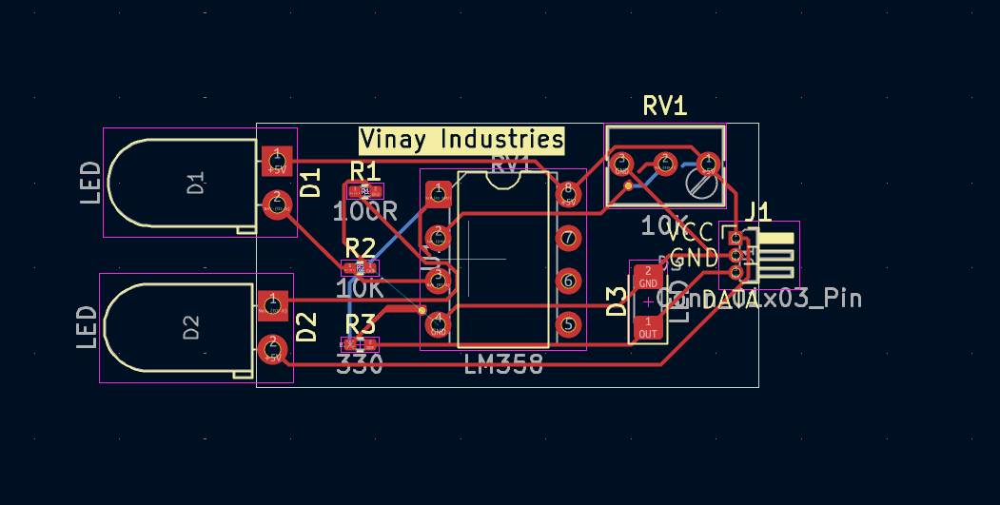
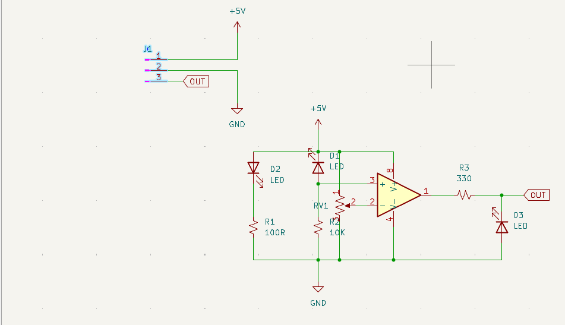
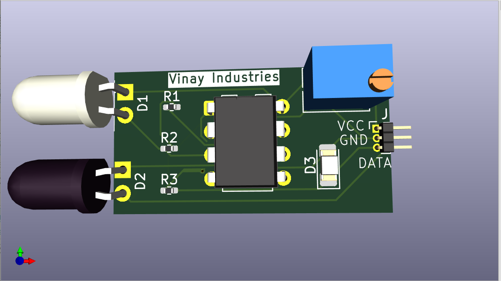

# IR Sensor Module — KiCad PCB Design

<div align="center">

**Manufacturer:** Vinay Industries &nbsp;|&nbsp; **IC:** LM358 Dual Op-Amp &nbsp;|&nbsp; **Tool:** KiCad EDA &nbsp;|&nbsp; **Version:** 1.0

[](https://www.kicad.org)
[](LICENSE)
[]()
[]()

</div>

---

## 📌 Table of Contents

- [Overview](#-overview)
- [Design Previews](#-design-previews)
- [Circuit Description](#-circuit-description)
- [Bill of Materials](#-bill-of-materials)
- [Connector Pinout](#-connector-pinout--j1)
- [PCB Specifications](#-pcb-specifications)
- [Project Structure](#-project-structure)
- [Getting Started with KiCad](#-getting-started-with-kicad)
- [Gerber Export](#-gerber-export-for-manufacturing)
- [Arduino Integration](#-arduino--microcontroller-integration)
- [Sensitivity Calibration](#-sensitivity-calibration)
- [Important Notes](#-important-notes)
- [License](#-license)

---

## 📖 Overview

This repository contains the complete **KiCad PCB design files** for an **Infrared (IR) Proximity / Obstacle Sensor Module** built around the **LM358 dual operational amplifier**. The circuit uses an IR LED emitter and IR photodiode receiver pair with a comparator stage to detect objects and output a clean **digital signal**.

A blue **trimmer potentiometer (RV1)** allows real-time sensitivity and detection range adjustment without any code changes.

### ✅ Key Features

| Feature | Detail |
|---------|--------|
| Supply Voltage | 5V DC |
| Output Type | Digital (HIGH / LOW) |
| Sensitivity Control | Onboard trimmer potentiometer (RV1) |
| Status Indicator | Onboard LED (D3) lights when object detected |
| MCU Compatibility | Arduino, ESP32, STM32, Raspberry Pi |
| IC | LM358 Dual Op-Amp (DIP-8) |
| PCB Layers | Single-layer (F.Cu) |
| Design Tool | KiCad EDA |

---

## 🖼 Design Previews

### PCB Layout — KiCad PCB Editor



> *Copper trace routing, component placement, silkscreen labels, and board outline as seen in KiCad PCB Editor. Components visible: D1, D2 (IR LEDs), R1–R3 (resistors), RV1 (trimmer), LM358 (DIP-8), D3 (status LED), J1 (3-pin header).*

---

### Schematic — KiCad Schematic Editor



> *Full circuit schematic showing the LM358 comparator, IR emitter/receiver voltage divider, sensitivity trimmer (RV1), and digital output stage with status LED (D3) and 3-pin connector (J1).*

---

### 3D Board Render



> *KiCad 3D render of the assembled PCB. Visible: white IR emitter (D1), black IR photodiode (D2), blue trimmer potentiometer (RV1), LM358 DIP-8 IC, SMD status LED (D3), and 3-pin output header (J1) labeled VCC / GND / DATA.*

---

## ⚡ Circuit Description

```
VCC (+5V)
  │
  ├──► D1 (IR LED Emitter) ──► R1 (100Ω) ──────────────────► GND   [IR Transmission]
  │
  ├──► D2 (IR Photodiode) + R2 (10kΩ divider) ─────────────► LM358 Non-Inverting (+)
  │                                                            [Received IR voltage]
  ├──► RV1 (10kΩ Trimmer) ──────────────────────────────────► LM358 Inverting (−)
  │                                                            [Threshold adjustment]
  │
  └──► LM358 Output ──► R3 (330Ω) ──► D3 (Status LED) ──────► DATA Pin (J1 Pin 3)
```

### How It Works

1. **IR Emitter (D1):** Continuously emits infrared light; current limited by R1 (100Ω).
2. **IR Receiver (D2):** Photodiode paired with R2 (10kΩ) forms a voltage divider. Output voltage rises when reflected IR light is detected from a nearby object.
3. **LM358 Comparator:** The op-amp compares two voltages:
   - **Non-inverting (+):** Photodiode output voltage (rises with reflected IR)
   - **Inverting (−):** Threshold voltage set by trimmer RV1
   - **Output:** HIGH when object detected, LOW when no object
4. **Output Stage:** When output is HIGH, current flows through R3 (330Ω) and lights status LED D3. The DATA pin simultaneously outputs HIGH for the MCU to read.
5. **Sensitivity Adjust (RV1):** Rotating the blue trimmer adjusts the comparator threshold and detection range.

---

## 🧾 Bill of Materials

| Ref | Component | Value | Package | Description |
|-----|-----------|-------|---------|-------------|
| D1 | IR LED Emitter | — | 5mm Through-hole | Infrared emitter (white body) |
| D2 | IR Photodiode | — | 5mm Through-hole | Infrared receiver (black body) |
| D3 | Status LED | — | SMD | Object detection indicator |
| R1 | Resistor | 100Ω | Through-hole | IR LED current limiter |
| R2 | Resistor | 10kΩ | Through-hole | Photodiode voltage divider |
| R3 | Resistor | 330Ω | Through-hole | Output LED current limiter |
| RV1 | Trimmer Pot | 10kΩ | Top-adjust blue | Sensitivity / threshold adjustment |
| U1 | LM358 | — | DIP-8 | Dual operational amplifier |
| J1 | Pin Header | 3-pin | 2.54mm pitch | VCC / GND / DATA output connector |

---

## 📌 Connector Pinout — J1

```
      J1 — 3-Pin Header (2.54mm pitch)
  ┌─────┬──────────┬────────────────────────────────────┐
  │ Pin │  Label   │ Description                        │
  ├─────┼──────────┼────────────────────────────────────┤
  │  1  │   VCC    │ Power supply input (+5V DC)        │
  │  2  │   GND    │ Ground                             │
  │  3  │  DATA    │ Digital output (HIGH = detected)   │
  └─────┴──────────┴────────────────────────────────────┘
```

> ⚠️ **Always verify polarity before connecting power. Reverse polarity may damage the IC.**

---

## 📐 PCB Specifications

| Parameter | Value |
|-----------|-------|
| Board Dimensions | ~75mm × 28mm |
| PCB Layers | 1 (Single-sided — F.Cu) |
| Surface Finish | HASL |
| PCB Thickness | 1.6mm |
| Min Track Width | 0.25mm |
| Min Clearance | 0.2mm |
| Silkscreen | Front side (labels + Vinay Industries branding) |
| IC Package | DIP-8 through-hole |
| LED Package | 5mm through-hole (D1, D2) + SMD (D3) |

---

## 📁 Project Structure

```
IR-Sensor-Module/
├── README.md                        ← This file
├── images/
│   ├── pcb_layout.png               ← PCB layout screenshot
│   ├── schematic.png                ← Schematic screenshot
│   └── 3d_render.png                ← 3D board render
├── IR_Sensor.kicad_pro              ← KiCad project file
├── IR_Sensor.kicad_sch              ← Schematic
├── IR_Sensor.kicad_pcb              ← PCB layout
├── fp-lib-table                     ← Footprint library table
├── sym-lib-table                    ← Symbol library table
├── gerbers/                         ← Gerber files for manufacturing
│   ├── IR_Sensor-F_Cu.gbr
│   ├── IR_Sensor-F_Silkscreen.gbr
│   ├── IR_Sensor-F_Mask.gbr
│   ├── IR_Sensor-Edge_Cuts.gbr
│   └── IR_Sensor-PTH.drl
└── bom/
    └── BOM.csv
```

---

## 🚀 Getting Started with KiCad

**Prerequisites:** [KiCad 7.x or later](https://www.kicad.org/download/)

```bash
# Clone the repository
git clone https://github.com/vinay-industries/ir-sensor-module.git
cd ir-sensor-module
```

In KiCad:
- **File → Open Project** → select `IR_Sensor.kicad_pro`
- Open **Schematic Editor** to view/edit the circuit diagram
- Open **PCB Editor** to view/edit the board layout
- In PCB Editor → **View → 3D Viewer** to inspect the 3D model

---

## 🏭 Gerber Export for Manufacturing

In KiCad PCB Editor:

```
File → Fabrication Outputs → Gerbers (.gbr)
```

| Layer | Purpose |
|-------|---------|
| F.Cu | Front copper traces |
| F.Silkscreen | Component labels |
| F.Mask | Solder mask |
| Edge.Cuts | Board outline |
| PTH Drill | Drill holes |

Zip the `/gerbers` folder and upload to your PCB manufacturer:
- [JLCPCB](https://jlcpcb.com) — Recommended for prototypes
- [PCBWay](https://www.pcbway.com)
- [OSH Park](https://oshpark.com)

---

## 🔌 Arduino / Microcontroller Integration

### Wiring

```
IR Sensor Module          Arduino Uno
─────────────────         ───────────
     VCC     ──────────►  5V
     GND     ──────────►  GND
     DATA    ──────────►  D7
```

### Example Sketch

```cpp
#define IR_SENSOR_PIN 7

void setup() {
  pinMode(IR_SENSOR_PIN, INPUT);
  Serial.begin(9600);
  Serial.println("IR Sensor Module Ready — Vinay Industries");
}

void loop() {
  int state = digitalRead(IR_SENSOR_PIN);

  if (state == HIGH) {
    Serial.println("Object Detected!");
  } else {
    Serial.println("No Object.");
  }

  delay(100);
}
```

---

## 🎛 Sensitivity Calibration

1. Power the module with **+5V DC** via J1 (VCC and GND pins).
2. Place a target object at your desired detection distance.
3. Using a small flathead screwdriver, slowly rotate the **blue trimmer (RV1)**:
   - **Clockwise** → Increases sensitivity (longer detection range)
   - **Counter-clockwise** → Decreases sensitivity (shorter range)
4. Stop when **Status LED D3 just turns ON** — calibration is complete.

> 💡 **Tip:** Recalibrate when changing target surface color or ambient lighting conditions.

---

## ⚠️ Important Notes

- **Digital output only** — no analog voltage is provided on the DATA pin.
- **Detection range:** Typically 2 cm – 30 cm depending on surface reflectivity.
- **Dark/black surfaces** absorb IR and significantly reduce effective range.
- **Avoid direct sunlight** — ambient IR can cause false positive detections.
- **LM358 output** is not rail-to-rail; LOW output may not reach exactly 0V.
- **Verify connector polarity** (VCC/GND/DATA) before applying power.

---

## 📜 License

This project is licensed under the **MIT License** — see the [LICENSE](LICENSE) file for details.
Free to use, modify, and manufacture for personal or commercial purposes with attribution.

---

<div align="center">

**Vinay Industries** — KiCad PCB Design | Embedded Electronics

*Designed with ❤️ using [KiCad EDA](https://www.kicad.org)*

</div># IR Sensor Module — KiCad PCB Design

<div align="center">

**Manufacturer:** Vinay Industries &nbsp;|&nbsp; **IC:** LM358 Dual Op-Amp &nbsp;|&nbsp; **Tool:** KiCad EDA &nbsp;|&nbsp; **Version:** 1.0

[](https://www.kicad.org)
[](LICENSE)
[]()
[]()

</div>

---

## 📌 Table of Contents

- [Overview](#-overview)
- [Design Previews](#-design-previews)
- [Circuit Description](#-circuit-description)
- [Bill of Materials](#-bill-of-materials)
- [Connector Pinout](#-connector-pinout--j1)
- [PCB Specifications](#-pcb-specifications)
- [Project Structure](#-project-structure)
- [Getting Started with KiCad](#-getting-started-with-kicad)
- [Gerber Export](#-gerber-export-for-manufacturing)
- [Arduino Integration](#-arduino--microcontroller-integration)
- [Sensitivity Calibration](#-sensitivity-calibration)
- [Important Notes](#-important-notes)
- [License](#-license)

---

## 📖 Overview

This repository contains the complete **KiCad PCB design files** for an **Infrared (IR) Proximity / Obstacle Sensor Module** built around the **LM358 dual operational amplifier**. The circuit uses an IR LED emitter and IR photodiode receiver pair with a comparator stage to detect objects and output a clean **digital signal**.

A blue **trimmer potentiometer (RV1)** allows real-time sensitivity and detection range adjustment without any code changes.

### ✅ Key Features

| Feature | Detail |
|---------|--------|
| Supply Voltage | 5V DC |
| Output Type | Digital (HIGH / LOW) |
| Sensitivity Control | Onboard trimmer potentiometer (RV1) |
| Status Indicator | Onboard LED (D3) lights when object detected |
| MCU Compatibility | Arduino, ESP32, STM32, Raspberry Pi |
| IC | LM358 Dual Op-Amp (DIP-8) |
| PCB Layers | Single-layer (F.Cu) |
| Design Tool | KiCad EDA |

---

## 🖼 Design Previews

### PCB Layout — KiCad PCB Editor


> *Copper trace routing, component placement, silkscreen labels, and board outline as seen in KiCad PCB Editor. Components visible: D1, D2 (IR LEDs), R1–R3 (resistors), RV1 (trimmer), LM358 (DIP-8), D3 (status LED), J1 (3-pin header).*

---

### Schematic — KiCad Schematic Editor


> *Full circuit schematic showing the LM358 comparator, IR emitter/receiver voltage divider, sensitivity trimmer (RV1), and digital output stage with status LED (D3) and 3-pin connector (J1).*

---

### 3D Board Render


> *KiCad 3D render of the assembled PCB. Visible: white IR emitter (D1), black IR photodiode (D2), blue trimmer potentiometer (RV1), LM358 DIP-8 IC, SMD status LED (D3), and 3-pin output header (J1) labeled VCC / GND / DATA.*

---

## ⚡ Circuit Description

```
VCC (+5V)
  │
  ├──► D1 (IR LED Emitter) ──► R1 (100Ω) ──────────────────► GND   [IR Transmission]
  │
  ├──► D2 (IR Photodiode) + R2 (10kΩ divider) ─────────────► LM358 Non-Inverting (+)
  │                                                            [Received IR voltage]
  ├──► RV1 (10kΩ Trimmer) ──────────────────────────────────► LM358 Inverting (−)
  │                                                            [Threshold adjustment]
  │
  └──► LM358 Output ──► R3 (330Ω) ──► D3 (Status LED) ──────► DATA Pin (J1 Pin 3)
```

### How It Works

1. **IR Emitter (D1):** Continuously emits infrared light; current limited by R1 (100Ω).
2. **IR Receiver (D2):** Photodiode paired with R2 (10kΩ) forms a voltage divider. Output voltage rises when reflected IR light is detected from a nearby object.
3. **LM358 Comparator:** The op-amp compares two voltages:
   - **Non-inverting (+):** Photodiode output voltage (rises with reflected IR)
   - **Inverting (−):** Threshold voltage set by trimmer RV1
   - **Output:** HIGH when object detected, LOW when no object
4. **Output Stage:** When output is HIGH, current flows through R3 (330Ω) and lights status LED D3. The DATA pin simultaneously outputs HIGH for the MCU to read.
5. **Sensitivity Adjust (RV1):** Rotating the blue trimmer adjusts the comparator threshold and detection range.

---

## 🧾 Bill of Materials

| Ref | Component | Value | Package | Description |
|-----|-----------|-------|---------|-------------|
| D1 | IR LED Emitter | — | 5mm Through-hole | Infrared emitter (white body) |
| D2 | IR Photodiode | — | 5mm Through-hole | Infrared receiver (black body) |
| D3 | Status LED | — | SMD | Object detection indicator |
| R1 | Resistor | 100Ω | Through-hole | IR LED current limiter |
| R2 | Resistor | 10kΩ | Through-hole | Photodiode voltage divider |
| R3 | Resistor | 330Ω | Through-hole | Output LED current limiter |
| RV1 | Trimmer Pot | 10kΩ | Top-adjust blue | Sensitivity / threshold adjustment |
| U1 | LM358 | — | DIP-8 | Dual operational amplifier |
| J1 | Pin Header | 3-pin | 2.54mm pitch | VCC / GND / DATA output connector |

---

## 📌 Connector Pinout — J1

```
      J1 — 3-Pin Header (2.54mm pitch)
  ┌─────┬──────────┬────────────────────────────────────┐
  │ Pin │  Label   │ Description                        │
  ├─────┼──────────┼────────────────────────────────────┤
  │  1  │   VCC    │ Power supply input (+5V DC)        │
  │  2  │   GND    │ Ground                             │
  │  3  │  DATA    │ Digital output (HIGH = detected)   │
  └─────┴──────────┴────────────────────────────────────┘
```

> ⚠️ **Always verify polarity before connecting power. Reverse polarity may damage the IC.**

---

## 📐 PCB Specifications

| Parameter | Value |
|-----------|-------|
| Board Dimensions | ~75mm × 28mm |
| PCB Layers | 1 (Single-sided — F.Cu) |
| Surface Finish | HASL |
| PCB Thickness | 1.6mm |
| Min Track Width | 0.25mm |
| Min Clearance | 0.2mm |
| Silkscreen | Front side (labels + Vinay Industries branding) |
| IC Package | DIP-8 through-hole |
| LED Package | 5mm through-hole (D1, D2) + SMD (D3) |

---

## 📁 Project Structure

```
IR-Sensor-Module/
├── README.md                        ← This file
├── images/
│   ├── pcb_layout.png               ← PCB layout screenshot
│   ├── schematic.png                ← Schematic screenshot
│   └── 3d_render.png                ← 3D board render
├── IR_Sensor.kicad_pro              ← KiCad project file
├── IR_Sensor.kicad_sch              ← Schematic
├── IR_Sensor.kicad_pcb              ← PCB layout
├── fp-lib-table                     ← Footprint library table
├── sym-lib-table                    ← Symbol library table
├── gerbers/                         ← Gerber files for manufacturing
│   ├── IR_Sensor-F_Cu.gbr
│   ├── IR_Sensor-F_Silkscreen.gbr
│   ├── IR_Sensor-F_Mask.gbr
│   ├── IR_Sensor-Edge_Cuts.gbr
│   └── IR_Sensor-PTH.drl
└── bom/
    └── BOM.csv
```

---

## 🚀 Getting Started with KiCad

**Prerequisites:** [KiCad 7.x or later](https://www.kicad.org/download/)

```bash
# Clone the repository
git clone https://github.com/vinay-industries/ir-sensor-module.git
cd ir-sensor-module
```

In KiCad:
- **File → Open Project** → select `IR_Sensor.kicad_pro`
- Open **Schematic Editor** to view/edit the circuit diagram
- Open **PCB Editor** to view/edit the board layout
- In PCB Editor → **View → 3D Viewer** to inspect the 3D model

---

## 🏭 Gerber Export for Manufacturing

In KiCad PCB Editor:

```
File → Fabrication Outputs → Gerbers (.gbr)
```

| Layer | Purpose |
|-------|---------|
| F.Cu | Front copper traces |
| F.Silkscreen | Component labels |
| F.Mask | Solder mask |
| Edge.Cuts | Board outline |
| PTH Drill | Drill holes |

Zip the `/gerbers` folder and upload to your PCB manufacturer:
- [JLCPCB](https://jlcpcb.com) — Recommended for prototypes
- [PCBWay](https://www.pcbway.com)
- [OSH Park](https://oshpark.com)

---

## 🔌 Arduino / Microcontroller Integration

### Wiring

```
IR Sensor Module          Arduino Uno
─────────────────         ───────────
     VCC     ──────────►  5V
     GND     ──────────►  GND
     DATA    ──────────►  D7
```

### Example Sketch

```cpp
#define IR_SENSOR_PIN 7

void setup() {
  pinMode(IR_SENSOR_PIN, INPUT);
  Serial.begin(9600);
  Serial.println("IR Sensor Module Ready — Vinay Industries");
}

void loop() {
  int state = digitalRead(IR_SENSOR_PIN);

  if (state == HIGH) {
    Serial.println("Object Detected!");
  } else {
    Serial.println("No Object.");
  }

  delay(100);
}
```

---

## 🎛 Sensitivity Calibration

1. Power the module with **+5V DC** via J1 (VCC and GND pins).
2. Place a target object at your desired detection distance.
3. Using a small flathead screwdriver, slowly rotate the **blue trimmer (RV1)**:
   - **Clockwise** → Increases sensitivity (longer detection range)
   - **Counter-clockwise** → Decreases sensitivity (shorter range)
4. Stop when **Status LED D3 just turns ON** — calibration is complete.

> 💡 **Tip:** Recalibrate when changing target surface color or ambient lighting conditions.

---

## ⚠️ Important Notes

- **Digital output only** — no analog voltage is provided on the DATA pin.
- **Detection range:** Typically 2 cm – 30 cm depending on surface reflectivity.
- **Dark/black surfaces** absorb IR and significantly reduce effective range.
- **LM358 output** is not rail-to-rail; LOW output may not reach exactly 0V.
- **Verify connector polarity** (VCC/GND/DATA) before applying power.

---

## 📜 License

This project is licensed under the **MIT License** — see the [LICENSE](LICENSE) file for details.
Free to use, modify, and manufacture for personal or commercial purposes with attribution.

---

<div align="center">

**Vinay Industries** — KiCad PCB Design | Embedded Electronics

*Designed with ❤️ using [KiCad EDA](https://www.kicad.org)*

</div>
